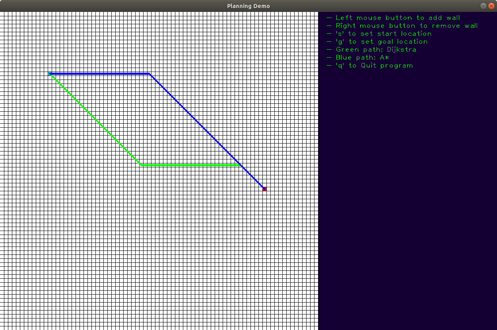
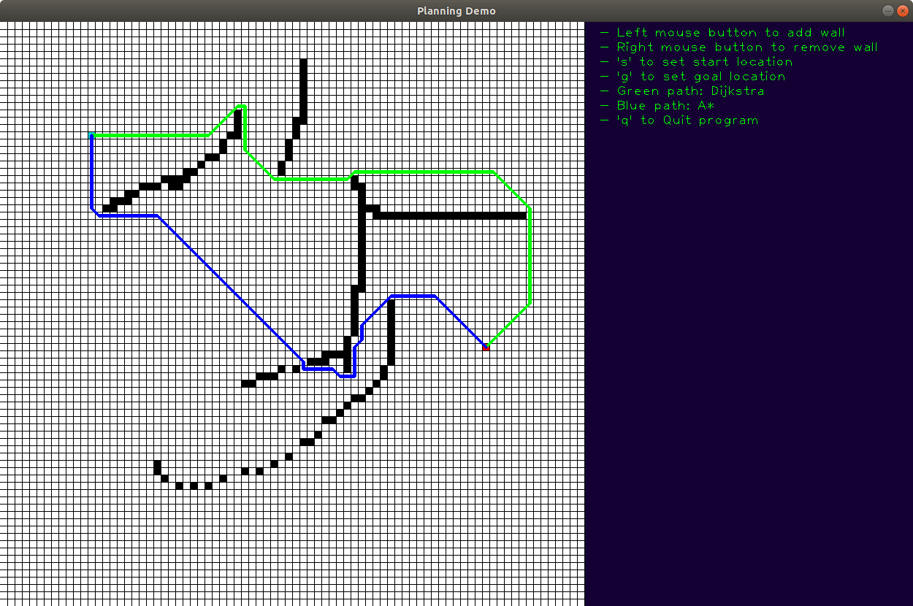
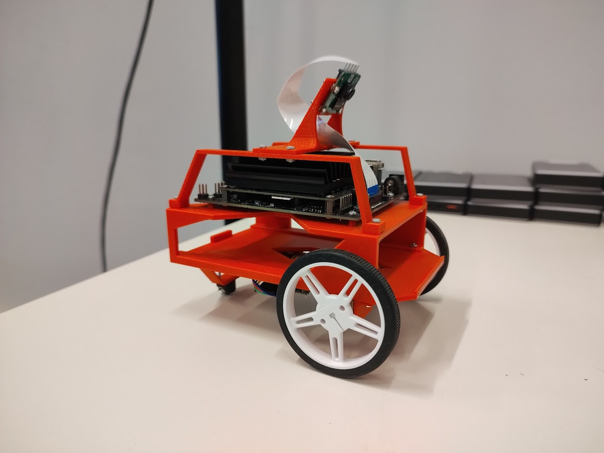
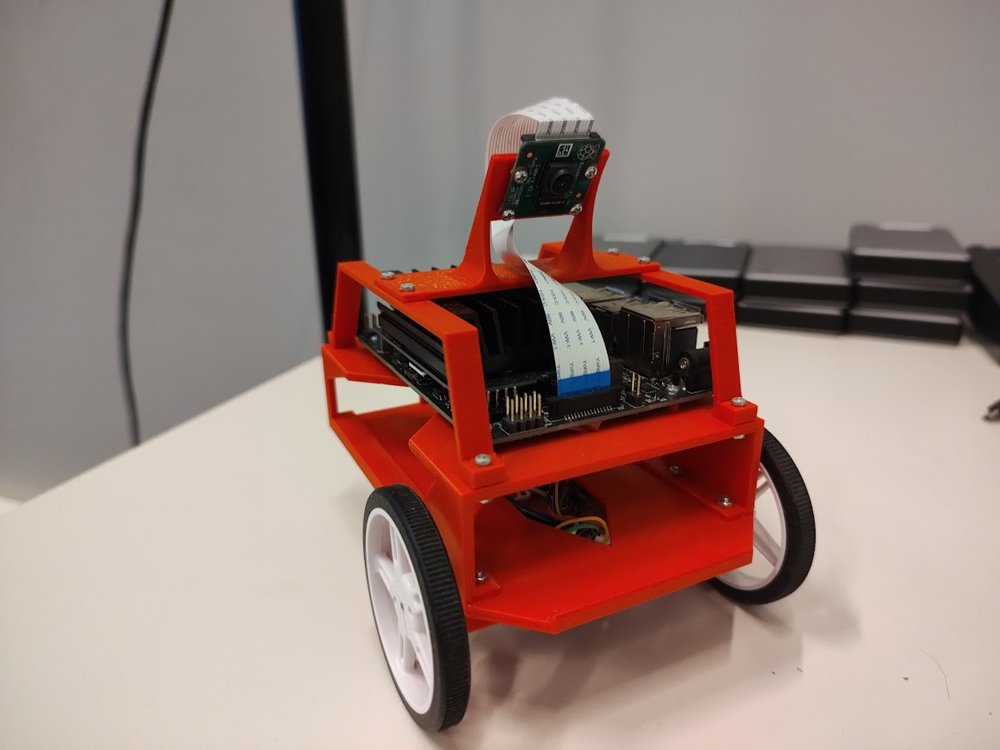
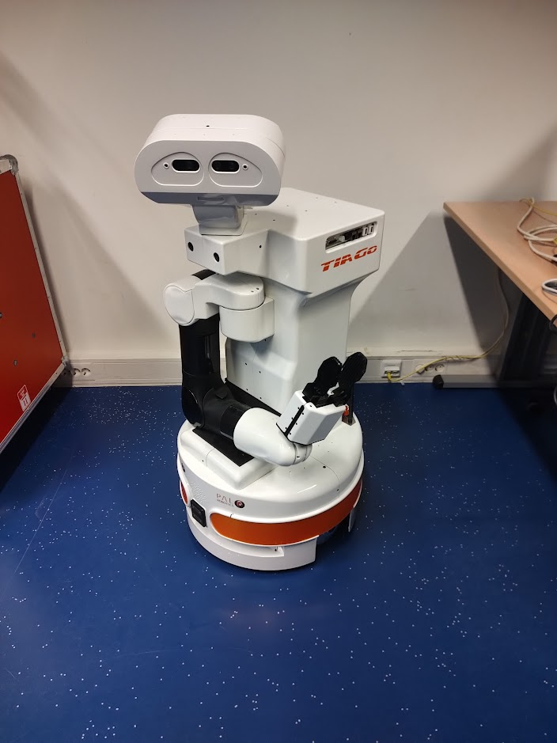

# Demo Projects and some work projects 
This pages shows some demo projects related to robotics, and some project/platforms used in my current job.
* [Demo Project, Cleaning Table with Mobile Manipulator Platform](#demo-project-cleaning-table-with-mobile-manipulator-platform)
* [Simple Object Recognition](#simple-object-recognition)
* [Simple Grasping](#simple-grasping)
* [Simple Motion Planning](#simple-motion-planning)
* [Simple Planning Demo](#simple-planning-demo)
* [Custom PCL Implementations](#custom-pcl-implementations)
* [(Some) Work Projects](#some-work-projects)

## Demo Project, Cleaning Table with Mobile Manipulator Platform

A demonstration was done with a mobile manipulator platform (named Alice). Alice was build by the Robotics Team at the University of Groningen. This demonstration was developed for Philips on behalf of Prof. Schomaker. The purpose was to demonstrate the capabilities of basic industrial maintenance tasks like cleaning and tidying up. In this demo the robot had to clean a table, by either removing a paper cup, or sweeping the table clean. A static camera was stationed behind the table to compute the areas that needed to be cleaned. 
The software was developed by me and Francesco Bidoia. Francesco developed the software for recognition of the areas to clean on the table and the general behaviour of the robot. I developed all the manipulation and movement of the robot by using Point Cloud data to determine the location of the table such that it can drive along side it. 

Video hosted on Prof. Schomaker's YouTube channel:



## Simple Object Recognition 
A simple object recognition demo that makes use of PCL to filter object Region of Interests and CNN for classifications. 
Using Point Cloud data the floor is filtered out and the remaining Point Cloud is clustered, for each cluster the ROI inside the RGB image is determined. The ROI is then resized and classified using a Convolutional Neural Network. This demo can classify 12 objects, the total data gathering and training took about 20 minutes. For each object 10 images are gathered and the dataset is then augmented. This project is done in ROS Noetic and Tensorflow.  

[Github repository](https://github.com/riktimmers/simple_object_recognition_demo)



## Simple Grasping
A simple grasping demo using a Franka Emika's Panda arm in simulation. A RGB-D camera is added to the end effector. The arm recognizes which object (a blue, red or green box) it is going to grasp and drop it in the corresponding colored bin. The dimensions and pose of the object is determined with PCL, the arm motions are computed using MoveIt. This project is done with ROS Noetic. 

[Github repository](https://github.com/riktimmers/simple_manipulation_demo)



## Simple Motion Planning
A simple motion planning demo using the RRT algorithm, custom Forward and Inverse Kinematics, and custom trajectory execution of the trajectory using interpolation and sending joint positions to the arm. 

[Github repository](https://github.com/riktimmers/simple_motion_planning_demo)



## Simple Planning Demo
A simple demo to show the Dijkstra and A* planning algorithms. The visualization is done using OpenCv.  

[Github repository](https://github.com/riktimmers/simple_planning)

 

## Custom PCL Implementations 

Some custom PCL function implementations for speed improvements. The custom functions that are implemented are clustering, passthrough and segmentation. When using all three functions the total speed-up can be about 26x faster on a Jetson Nano, to 44x faster on a Desktop/Laptop cpu. 

[Github repository](https://github.com/riktimmers/pcl_custom_functions)

## (Some) Work Projects 
Designed a small differential drive robot. The robot has a Jetson Nano and a Teensy 3.6, two small DC motors with encoders, and an Raspberry Pi RGB Camera. 
The robot was designed (based on the JetBot) for usage in Robotics courses for Bachelor AI students. The student can implement low level PID controllers for the velocity control 
of the wheels, use the camera for lane following and sign recognition. Students can remotely access the robot, and visualize the camera images on their lab PCs. 

 

TiaGo was used in our Robotics for AI course for Master students (it is now replaced by a smaller omni-directional drive robot). Students can perform navigation, object recognition, and grasping with TiaGo. An order was given containing which objects had to gathered, the robot than has to find the objects located on two tables and drop the objects in a box.
TiaGo had to be made ready (on a software level) for usage in our course. This included turning off default programs that get started when TiaGo boots up, making adjustments to its URDF to avoid self-collisions, testing the complete pipeline that students had to implement, coming up with a safe method such that the arm does not collide with the table. 

